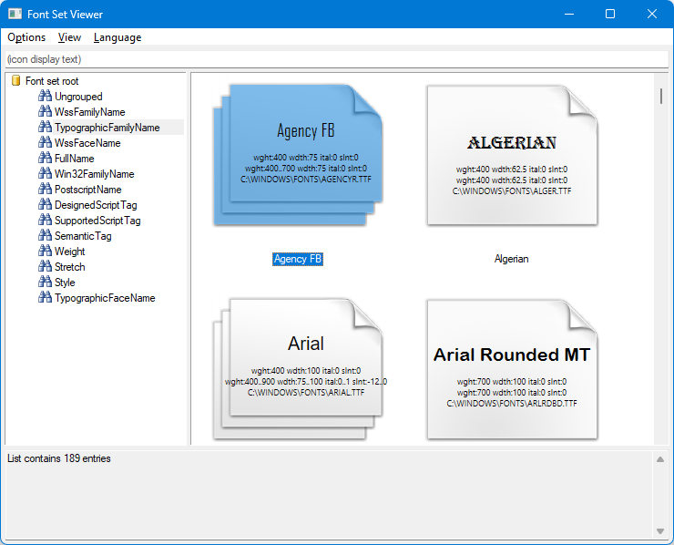

# DWrite FontSetViewer
Simple utility to display items in an IDWriteFontSet.

- Preview item in font
- Displays axis information (on Windows 10+ RS3 Fall Creator's Update Build 10.0.16170 1709)
- Browse/sort/filter by item name strings
- Load custom fonts (no need to install them first, just File/Open or drag&drop)
- Copy names to clipboard

C++, compiled with Visual Studio 2017 RC.

